## Using Python Selenium to Automate Tasks

### Selenium by Example

Selenium is a great tool to write functional/acceptance tests and automation scripts that require interaction with a webpage. 

In this lesson we get Selenium running and look at two use cases. Then we have you code 1 or 2 scripts using Selenium.

To follow along you need have Selenium installed and a webdriver:

1. `pip install selenium` (if you installed the requirements.txt in my setup video in the appendix you should already have it)
2. I used _PhantomJS_ before but now I got this error: `Selenium support for PhantomJS has been deprecated, please use headless versions of Chrome or Firefox instead`. So I downloaded the [ChromeDriver](https://sites.google.com/a/chromium.org/chromedriver/home) and put it in my `PATH` (`$HOME/bin`)

Here is the _Hello Selenium world_ example from [the docs](http://selenium-python.readthedocs.io/getting-started.html). Notice how easy it is to interact with forms:


```python
from selenium import webdriver
from selenium.webdriver.common.keys import Keys

driver = webdriver.Chrome()  # replaced Firefox by Chrome
driver.get("http://www.python.org")
assert "Python" in driver.title
elem = driver.find_element_by_name("q")
elem.clear()
elem.send_keys("pycon")
elem.send_keys(Keys.RETURN)
assert "No results found." not in driver.page_source
driver.close()
```

#### Example 1. Packt ebook manager

Packt gives away [a free ebook each day](https://www.packtpub.com/packt/offers/free-learning). I've been grabbing quite a few of them (back in our 100 Days we [wrote a notification script](https://github.com/pybites/100DaysOfCode/blob/master/076/packt_notification.py)). 

In this section I will make a simple Selenium script to search my collection for a title and provide me the download link. Of course my books are behind login, so I use Selenium to login first. This script/idea also came out of our own 100 days of code, see [day 66](https://github.com/pybites/100DaysOfCode/blob/master/066/packt.py).

How would this work? Quite simply:

1. Go to the Packt login URL and login:
    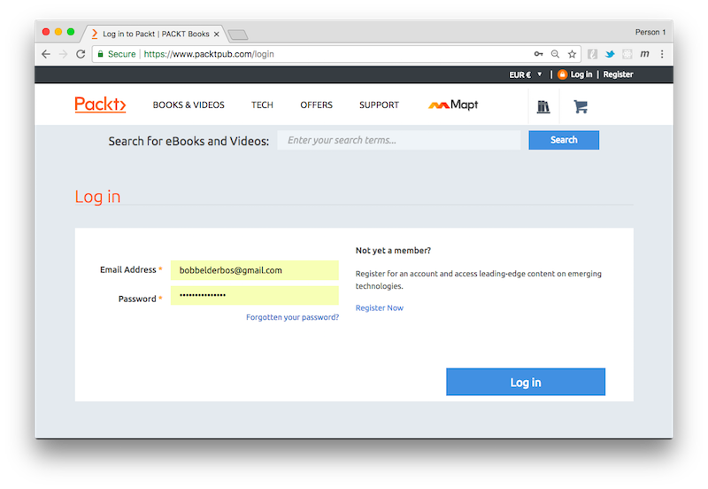
2. You get to your Account page:
    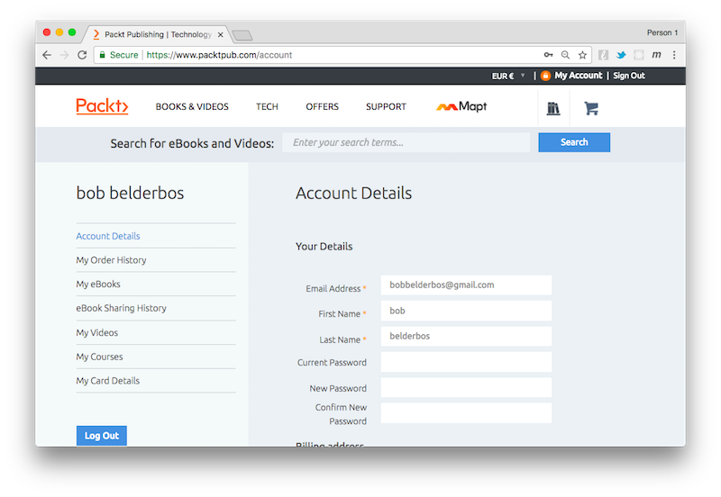
3. Go the _My eBooks_ links and parse the html:
    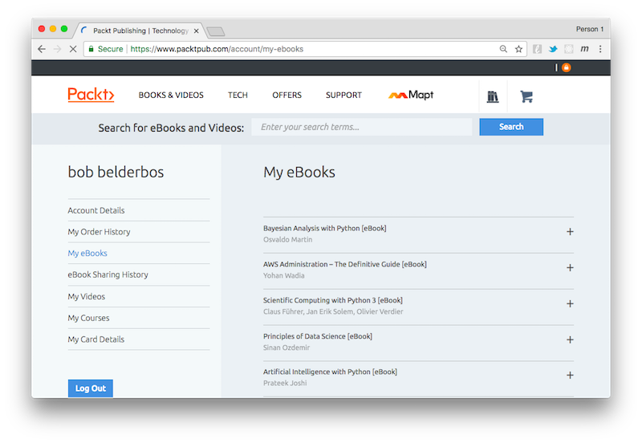

Let's get coding!

First of all as per [The twelve-factor app](https://12factor.net/config) I store config details in the environment, __never__ in the script. 

`os.environ.get` lets you retrieve environment variables defaulting to `None` if not found. The check for `None` I consider a more Pythonic pattern and to increase the readability I added my own exception: `NoLogin`.


```python
import os

user = os.environ.get('PACKT_USER')
pw = os.environ.get('PACKT_PW')
```

As shown in the example before we create a `driver` object and go to the `login` URL. We find the `edit-name` and `edit-pass` form elements and send the user and password (stored in the `user` and `pw` variables respectively). Appending the `Keys.RETURN` submits the form (html forms can be submitted by hitting Enter on an input field, not so on a textarea box, there it would enter a newline).


```python
login = 'https://www.packtpub.com/login'

driver = webdriver.Chrome()
driver.get(login)

driver.find_element_by_id('edit-name').send_keys(user)
driver.find_element_by_id('edit-pass').send_keys(pw + Keys.RETURN)
```

Note that at this point a Chrome browser window opened in the background. It will close when we close the driver later:

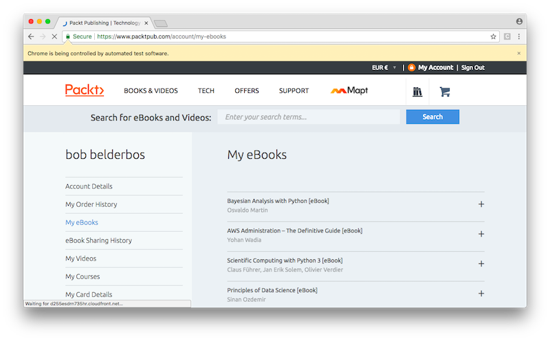

Als note that here is a natural delay between steps because we are using a notebook. In a script though steps run one after the other at lightning speed. 

Also in this case there is no pagination, so my 100+ books take some time to load. So if you use this as a script you might want to add: `driver.implicitly_wait(3)`

Now let's get to the actual content, storing it in `elements`:


```python
driver.find_element_by_link_text('My eBooks').click()
```

Next I use a _dictionary comprehension_ to store the book id (`nid`) as keys and the book titles as values. You could sync this to a local file or sqlite DB if you want to cache these results. 


```python
elements = driver.find_elements_by_class_name("product-line")
books = {e.get_attribute('nid'): e.get_attribute('title') for e in elements}
books
```


    {'10068': 'Learning Ext JS 4 [eBook]',
     '10264': 'Implementing Splunk: Big Data Reporting and Development for Operational Intelligence [eBook]',
     '10744': 'Nagios Core Administration Cookbook [eBook]',
     '10763': 'Continuous Delivery and DevOps: A Quickstart guide [eBook]',
     '11441': 'Learning SciPy for Numerical and Scientific Computing [eBook]',
     '11703': 'Building Machine Learning Systems with Python [eBook]',
     '11723': 'Learning jQuery - Fourth Edition [eBook]',
     '11913': 'Mastering Web Application Development with AngularJS [eBook]',
     '12001': 'OpenCV Computer Vision with Python [eBook]',
     '12050': "Magento : Beginner's Guide - Second Edition [eBook]",
     '12318': 'Python Geospatial Development - Second Edition [eBook]',
     '12364': 'Object-Oriented JavaScript - Second Edition [eBook]',
     '12730': 'Learning Vaadin 7: Second Edition [eBook]',
     '12883': '3D Printing Blueprints [eBook]',
     '13253': 'Boost C++ Application Development Cookbook [eBook]',
     '13532': 'Python Data Visualization Cookbook [eBook]',
     '13804': 'Mastering ElasticSearch [eBook]',
     '13964': 'Mastering Apache Cassandra [eBook]',
     '14030': 'Network Analysis using Wireshark Cookbook [eBook]',
     '14165': 'Node Security [eBook]',
     '14254': 'Kali Linux Cookbook [eBook]',
     '14519': 'PySide GUI Application Development [eBook]',
     '14770': 'Raspberry Pi Cookbook for Python Programmers [eBook]',
     '15070': 'Kali Linux Social Engineering [eBook]',
     '15280': 'Learning Python Design Patterns [eBook]',
     '15363': 'Unity Multiplayer Games [eBook]',
     '15550': 'Blender 3D Printing Essentials [eBook]',
     '15597': 'Advanced Express Web Application Development [eBook]',
     '15642': 'Kali Linux – Assuring Security by Penetration Testing [eBook]',
     '16230': 'Applied Architecture Patterns on the Microsoft Platform (Second Edition) [eBook]',
     '16271': 'Linux Mint Essentials [eBook]',
     '16279': 'MongoDB Cookbook [eBook]',
     '16352': 'Backbone.js Patterns and Best Practices [eBook]',
     '16616': 'Social Media Mining with R [eBook]',
     '16625': 'Mastering Python Regular Expressions [eBook]',
     '16637': 'IPython Interactive Computing and Visualization Cookbook [eBook]',
     '16735': 'Mastering D3.js [eBook]',
     '16872': 'Node.js Blueprints [eBook]',
     '16904': 'Learning Web Development with Bootstrap and AngularJS [eBook]',
     '17007': 'Getting Started with LLVM Core Libraries [eBook]',
     '17011': 'Mastering Object-oriented Python [eBook]',
     '17102': 'Unity 4 Game Development Hotshot [eBook]',
     '17276': 'Mastering AngularJS Directives [eBook]',
     '17371': 'Penetration Testing with the Bash shell [eBook]',
     '17384': 'Natural Language Processing with Java and LingPipe Cookbook [eBook]',
     '17399': 'Machine Learning with Spark [eBook]',
     '17421': 'OpenCV for Secret Agents [eBook]',
     '17436': 'Learning Raspberry Pi [eBook]',
     '17477': 'MEAN Web Development [eBook]',
     '17490': 'Python 3 Text Processing with NLTK 3 Cookbook [eBook]',
     '17514': 'HBase Design Patterns [eBook]',
     '17645': 'Practical Data Science Cookbook [eBook]',
     '17682': 'Building Business Websites with Squarespace 7 [eBook]',
     '17722': 'Creative Greenfoot [eBook]',
     '17805': 'Mastering Machine Learning with scikit-learn [eBook]',
     '17814': 'AngularJS UI Development [eBook]',
     '17954': 'Python Machine Learning [eBook]',
     '17961': 'Web Development with Django Cookbook [eBook]',
     '17973': 'Python for Secret Agents [eBook]',
     '18044': 'Testing and Securing Android Studio Applications [eBook]',
     '18052': 'Mastering Python Design Patterns [eBook]',
     '18071': 'HBase Essentials [eBook]',
     '18127': 'Node.js Design Patterns [eBook]',
     '18678': 'Mockito Essentials [eBook]',
     '18879': 'Wireshark Essentials [eBook]',
     '18895': 'R Graphs Cookbook Second Edition [eBook]',
     '18942': 'scikit-learn Cookbook [eBook]',
     '18951': 'Learning JavaScript Data Structures and Algorithms [eBook]',
     '19168': 'Git Best Practices Guide [eBook]',
     '19294': 'Learning R for Geospatial Analysis  [eBook]',
     '19313': 'StartupPro: How to set up and grow a tech business [eBook]',
     '19387': 'Learning NGUI for Unity [eBook]',
     '19444': 'AngularJS Web Application Development Cookbook [eBook]',
     '19462': 'Go Programming Blueprints [eBook]',
     '19490': 'Learning Java by Building Android Games [eBook]',
     '19564': 'Mastering R for Quantitative Finance [eBook]',
     '19569': 'Raspberry Pi for Secret Agents - Second Edition [eBook]',
     '19599': 'Learning iOS 8 for Enterprise [eBook]',
     '19799': 'Learning C++ by Creating Games with UE4 [eBook]',
     '19853': 'Learning pandas [eBook]',
     '19884': 'Learning Docker [eBook]',
     '19932': "Kali Linux Wireless Penetration Testing: Beginner's Guide [eBook]",
     '1995': 'Drupal 6 Search Engine Optimization [eBook]',
     '20002': 'Learning Scrapy [eBook]',
     '20005': 'Arduino Development Cookbook [eBook]',
     '20047': 'Docker Cookbook [eBook]',
     '20117': 'Learning Robotics Using Python [eBook]',
     '20125': 'Functional Python Programming [eBook]',
     '20217': 'R Data Visualization Cookbook [eBook]',
     '20264': 'Python 3 Object-oriented Programming - Second Edition [eBook]',
     '20300': 'RESTful Web API Design with Node.js [eBook]',
     '20377': 'Mastering Embedded Linux Programming [eBook]',
     '20389': 'WordPress 4.x Complete [eBook]',
     '20615': 'Mastering Python for Finance [eBook]',
     '20820': 'Learning Python Network Programming [eBook]',
     '20825': 'Thinking in JavaScript [eBook]',
     '20826': 'Thinking in CSS [eBook]',
     '20892': 'Mastering Windows PowerShell Scripting [eBook]',
     '20893': 'Django By Example [eBook]',
     '20927': 'Learning .NET High-performance Programming [eBook]',
     '20987': 'Practical Machine Learning [eBook]',
     '2101': 'ASP.NET Data Presentation Controls Essentials [eBook]',
     '21051': 'Learning Reactive Programming with Java 8 [eBook]',
     '21104': 'Mastering matplotlib [eBook]',
     '21105': 'DevOps Automation Cookbook [eBook]',
     '21201': 'Learning Data Mining with Python [eBook]',
     '21307': 'Rust Essentials [eBook]',
     '21310': 'Clean Data [eBook]',
     '21392': 'Learning Flask Framework [eBook]',
     '21460': 'Unity 5.x Cookbook [eBook]',
     '21472': 'RESTful Java Web Services - Second Edition [eBook]',
     '21483': 'Blueprints Visual Scripting for Unreal Engine [eBook]',
     '21558': 'React.js Essentials [eBook]',
     '21583': 'Android Game Programming by Example [eBook]',
     '21612': 'Test-Driven Java Development [eBook]',
     '2166': 'MediaWiki Administrators’ Tutorial Guide [ebook]',
     '21834': 'SFML Game Development By Example [eBook]',
     '21931': 'Learning Object-Oriented Programming [eBook]',
     '2196': 'JasperReports 3.5 for Java Developers [eBook]',
     '21976': 'Mastering Git [eBook]',
     '21985': 'Python Game Programming By Example [eBook]',
     '21989': 'Machine Learning with R - Second Edition [eBook]',
     '22006': 'Responsive Web Design with HTML5 and CSS3 - Second Edition [eBook]',
     '22025': 'Getting Started with PowerShell [eBook]',
     '22031': 'Learning Python [eBook]',
     '22041': 'Learning PostgreSQL [eBook]',
     '22148': 'Python Parallel Programming Cookbook [eBook]',
     '2219': 'Expert Python Programming [eBook]',
     '22261': 'Learning AWS [eBook]',
     '22273': 'Mastering Responsive Web Design [eBook]',
     '22314': 'Learning ECMAScript 6 [eBook]',
     '22318': 'Building a Recommendation System with R [eBook]',
     '22369': 'Learning Penetration Testing with Python [eBook]',
     '22410': 'Cross-platform UI Development with Xamarin.Forms [eBook]',
     '2248': 'Object-Oriented Programming with PHP5 [eBook]',
     '22511': 'Unity AI Game Programming - Second Edition [eBook]',
     '2262': 'Service Oriented Architecture with Java [eBook]',
     '22653': 'Learning Bayesian Models with R [eBook]',
     '22681': 'Unity 5 Game Optimization [eBook]',
     '22791': 'D3.js By Example [eBook]',
     '22827': 'Learning TypeScript [eBook]',
     '22857': 'Python GUI Programming Cookbook [eBook]',
     '22889': 'Blender 3D by Example [eBook]',
     '22902': 'Procedural Content Generation for C++ Game Development [eBook]',
     '23013': 'GitHub Essentials [eBook]',
     '23045': 'Mastering Social Media Mining with R [eBook]',
     '23073': "Magento 2 Developer's Guide [eBook]",
     '23132': 'Neural Network Programming with Java [eBook]',
     '23153': 'Practical DevOps [eBook]',
     '23352': 'OpenCV By Example [eBook]',
     '23375': 'Web Development with Django Cookbook - Second Edition [eBook]',
     '23391': 'Learning Predictive Analytics with Python [eBook]',
     '23395': 'Python Unlocked [eBook]',
     '23411': 'Mastering Python [eBook]',
     '23427': 'Mastering JavaScript [eBook]',
     '23446': 'Raspberry Pi By Example [eBook]',
     '23460': 'Python Geospatial Development - Third Edition [eBook]',
     '23463': 'Bitcoin Essentials [eBook]',
     '23519': 'Bayesian Analysis with Python [eBook]',
     '23562': 'Mastering C# Concurrency [eBook]',
     '23679': 'AWS Administration – The Definitive Guide [eBook]',
     '23687': 'Mastering React [eBook]',
     '23694': 'Unity 5.x Shaders and Effects Cookbook [eBook]',
     '23780': 'Bootstrap Site Blueprints Volume II [eBook]',
     '23802': 'MongoDB Cookbook - Second Edition [eBook]',
     '23827': 'Learning Linux Binary Analysis [eBook]',
     '23846': 'Mastering Docker [eBook]',
     '23851': 'Android Programming for Beginners [eBook]',
     '23922': 'Building a Game with Unity and Blender [eBook]',
     '23924': 'Tkinter GUI Application Development Blueprints [eBook]',
     '23971': 'Learning Python Design Patterns - Second Edition [eBook]',
     '24015': 'Java Deep Learning Essentials [eBook]',
     '24068': 'Learning Python for Forensics [eBook]',
     '24109': 'Mastering Linux Shell Scripting [eBook]',
     '24161': 'Data Analysis with R [eBook]',
     '24179': 'Learning C# by Developing Games with Unity 5.x - Second Edition [eBook]',
     '24198': 'Flask By Example [eBook]',
     '24221': 'Python Machine Learning Blueprints: Intuitive data projects you can relate to [eBook]',
     '24258': 'Switching to Angular 2 [eBook]',
     '24294': 'Learning Angular 2 [eBook]',
     '24307': 'Advanced Penetration Testing for Highly-Secured Environments - Second Edition [eBook]',
     '24349': 'Principles of Data Science [eBook]',
     '24462': 'Learning PHP 7 [eBook]',
     '24475': 'Python Projects for Kids [eBook]',
     '24642': 'Multithreading with C# Cookbook - Second Edition [eBook]',
     '24661': 'Mastering Social Media Mining with Python [eBook]',
     '24680': 'Getting Started with Raspberry Pi Zero [eBook]',
     '24757': 'ReactJS Blueprints [eBook]',
     '24789': 'TypeScript Design Patterns [eBook]',
     '24807': 'R Deep Learning Essentials [eBook]',
     '24826': 'Machine Learning for the Web [eBook]',
     '24835': 'Modular Programming with Python [eBook]',
     '24907': 'C# 6 and .NET Core 1.0: Modern Cross-Platform Development [eBook]',
     '24949': 'Practical Linux Security Cookbook [eBook]',
     '25015': 'Node.js Web Development - Third Edition [eBook]',
     '25031': 'Practical Digital Forensics [eBook]',
     '25052': 'Mastering Wireshark [eBook]',
     '25098': 'Node.js Design Patterns - Second Edition [eBook]',
     '25143': 'Modern Python Cookbook [eBook]',
     '25232': 'Kubernetes Cookbook [eBook]',
     '25257': 'Expert Python Programming - Second Edition [eBook]',
     '25293': 'Professional CSS3 [eBook]',
     '25298': 'Practical Internet of Things Security [eBook]',
     '25319': 'MEAN Web Development - Second Edition [eBook]',
     '25366': 'Beginning C++ Game Programming [eBook]',
     '25608': 'Learning Python Application Development [eBook]',
     '25854': 'What You Need to Know about Docker [eBook]',
     '25976': 'Raspberry Pi for Secret Agents - Third Edition [eBook]',
     '26062': 'Learning Web Development with React and Bootstrap [eBook]',
     '26197': 'Automate it! - Recipes to upskill your business [eBook]',
     '26256': 'Artificial Intelligence with Python [eBook]',
     '26263': ' Skill Up 2016: Developer Skills Report [eBook]',
     '26288': 'What you need to know about Angular 2 [eBook]',
     '26325': 'Practical Data Analysis - Second Edition [eBook]',
     '26564': 'Learning PySpark [eBook]',
     '26678': 'PostgreSQL Development Essentials [eBook]',
     '26759': 'What You Need to Know about Python [eBook]',
     '26781': 'Building RESTful Python Web Services [eBook]',
     '27102': 'React Native Cookbook [eBook]',
     '27146': 'Python Data Science Essentials - Second Edition [eBook]',
     '27455': 'Scientific Computing with Python 3 [eBook]',
     '27683': 'What You Need to Know about Machine Learning [eBook]',
     '30182': 'Skill Up 2017 [eBook]',
     '4190': 'Matplotlib for Python Developers [eBook]',
     '4569': "Python Testing: Beginner's Guide [eBook]",
     '5188': 'Agile Web Application Development with Yii1.1 and PHP5 [eBook]',
     '5286': 'MySQL for Python [eBook]',
     '5317': 'Python 3 Object Oriented Programming [eBook]',
     '5568': 'PHP 5 Social Networking [eBook]',
     '5736': 'Java EE 6 with GlassFish 3 Application Server[eBook]',
     '5905': "JavaScript Testing Beginner's Guide  [eBook]",
     '6066': 'NHibernate 3.0 Cookbook [eBook]',
     '6088': 'PostgreSQL 9 Admin Cookbook [eBook]',
     '6195': 'Drupal 7 Module Development [eBook]',
     '6477': 'Statistical Analysis with R [eBook]',
     '6539': 'Using CiviCRM [eBook]',
     '6582': 'Blender 2.5 Materials and Textures Cookbook [eBook]',
     '6687': 'Linux Shell Scripting Cookbook [eBook]',
     '6972': "Android User Interface Development: Beginner's Guide [eBook]",
     '7193': "LaTex Beginner's Guide [eBook]",
     '7203': "Python 3 Web Development Beginner's Guide [eBook]",
     '7333': 'Java EE 6 Development with NetBeans 7 [eBook]',
     '7690': 'OpenCV 2 Computer Vision Application Programming Cookbook [eBook]',
     '8294': 'Learning jQuery, Third Edition [eBook]',
     '8386': 'Moodle 2.0 E-Learning Course Development [eBook]',
     '8689': 'Microsoft SharePoint 2010 and Windows PowerShell 2.0: Expert Cookbook [eBook]',
     '8717': 'PHP Ajax Cookbook [eBook]',
     '9017': "Google SketchUp for Game Design: Beginner's Guide [eBook]",
     '9368': "PHP Application Development with NetBeans: Beginner's Guide [eBook]",
     '9837': 'The Game Jam Survival Guide [eBook]',
     None: ''}


First time around I made the mistake to close `driver` after `elements`, but `get_attribute` I used in `books` still needs the session. So only now should you close it. This also closes the Chrome app:


```python
driver.close()
```

Now let's write a function to receive a regex search term and book format and print the books that match the books in my collection:


```python
import re

DOWNLOAD_URL = 'https://www.packtpub.com/ebook_download/{nid}/{ebook_format}'
BOOK_FORMATS = 'pdf epub mobi'

def get_books(grep, ebook_format):
    """Receives a grep regex and book format (epub, pdf, mobi)
       and prints the titles + urls of matching ebooks"""
    grep = grep.lower()
    ebook_format = ebook_format.lower()
    if ebook_format not in BOOK_FORMATS.split():
        raise ValueError(f'Not a valid book format (valid are: {BOOK_FORMATS})')
        
    for nid, title in books.items():
        if re.search(grep, title.lower()):
            url = DOWNLOAD_URL.format(nid=nid, ebook_format=ebook_format)
            print(title, url)
```


```python
get_books('python.*data', 'mobi')
```

    Python Data Science Essentials - Second Edition [eBook] https://www.packtpub.com/ebook_download/27146/mobi
    Python Machine Learning Blueprints: Intuitive data projects you can relate to [eBook] https://www.packtpub.com/ebook_download/24221/mobi
    Python Data Visualization Cookbook [eBook] https://www.packtpub.com/ebook_download/13532/mobi


```python
get_books('Machine.*Learning', 'PDF')
```

    Machine Learning for the Web [eBook] https://www.packtpub.com/ebook_download/24826/pdf
    Python Machine Learning Blueprints: Intuitive data projects you can relate to [eBook] https://www.packtpub.com/ebook_download/24221/pdf
    What You Need to Know about Machine Learning [eBook] https://www.packtpub.com/ebook_download/27683/pdf
    Mastering Machine Learning with scikit-learn [eBook] https://www.packtpub.com/ebook_download/17805/pdf
    Practical Machine Learning [eBook] https://www.packtpub.com/ebook_download/20987/pdf
    Machine Learning with R - Second Edition [eBook] https://www.packtpub.com/ebook_download/21989/pdf
    Machine Learning with Spark [eBook] https://www.packtpub.com/ebook_download/17399/pdf
    Python Machine Learning [eBook] https://www.packtpub.com/ebook_download/17954/pdf
    Building Machine Learning Systems with Python [eBook] https://www.packtpub.com/ebook_download/11703/pdf


#### Example 2. autocreate a PyBites banner

Some time ago [I made a banner generator with Pillow and Flask](https://pybit.es/pillow-banner-flask.html). It is hosted [here](http://pybites-banners.herokuapp.com). 

Although this is nice what if I want to make banners automatically? Let's try to do so using Selenium:

Let's break the task down into various steps:

1. Although the site can be used without login, authenticated users have their banners stored, so go straight to login URL:
    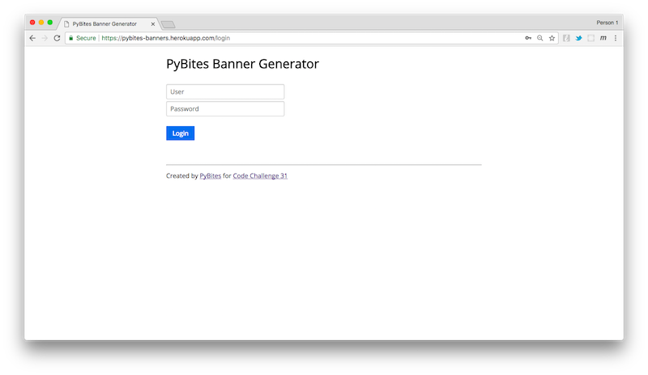

2. And login: 
    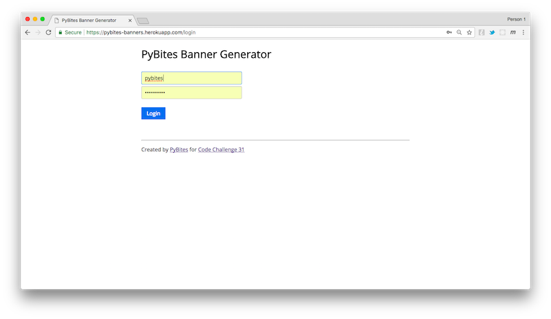

3. We need to locate the form elements and provide the proper data, then click the submit button:
    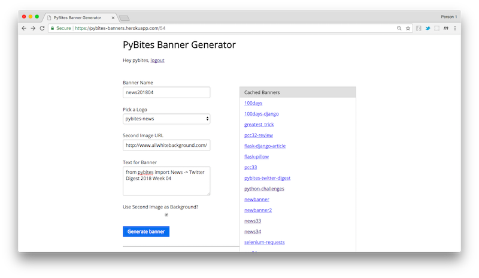

4. We need to download the output image it generates:
    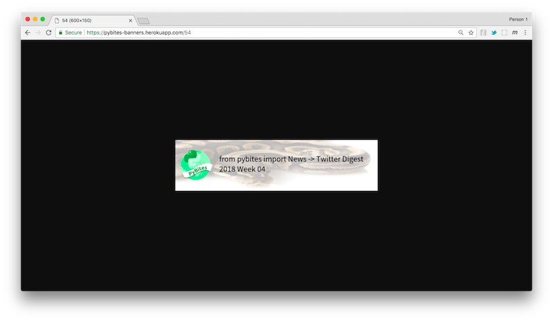

After previous exercise this should be quite straight-forward:


```python
user = os.environ.get('PB_BANNER_USER')
pw = os.environ.get('PB_BANNER_PW')

class NoLogin(Exception):
    pass

if user is None or pw is None:
    raise NoLogin('Set PB_BANNER_USER and PB_BANNER_PW in your env')
```


```python
login = 'https://pybites-banners.herokuapp.com/login'

driver = webdriver.Chrome()
driver.get(login)

driver.find_element_by_id('username').send_keys(user)
driver.find_element_by_id('password').send_keys(pw + Keys.RETURN)
```


```python
from datetime import datetime

def get_title():
    """Creates a title to store banner as, e.g. newsYYYYWW
       (YYYY = year, WW = week number)"""
    now = datetime.now()
    year = now.year
    week = str(now.isocalendar()[1]).zfill(2)
    return f'news{year}{week}'

title = get_title()
```


```python
now = datetime.now()
year = now.year
week = str(now.isocalendar()[1]).zfill(2)
news_option = 'pybites-news'

bg_image = 'http://www.allwhitebackground.com/images/2/2210.jpg'
banner_text = f'from pybites import News -> Twitter Digest {year} Week {week}'

driver.find_element_by_id('name').send_keys(title)
driver.find_element_by_xpath(f'//select[@name="image_url1"]/option[text()="{news_option}"]').click()
driver.find_element_by_id('text').send_keys(banner_text)
driver.find_element_by_id('image_url2').send_keys(bg_image + Keys.RETURN)
```

And the result:


```python
driver.close()
```

### Concepts

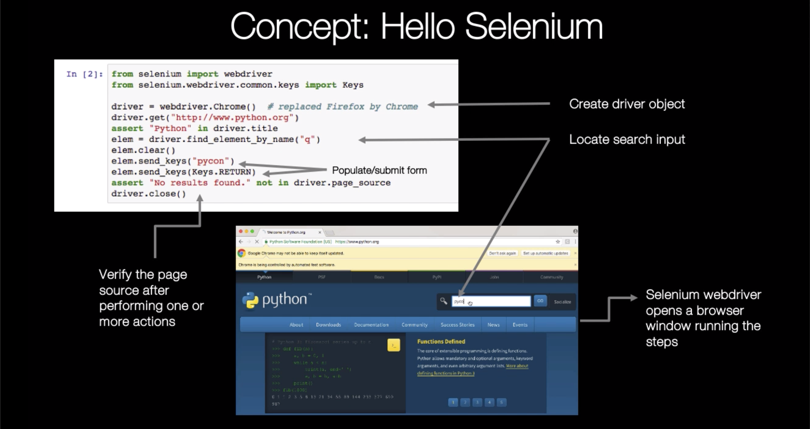

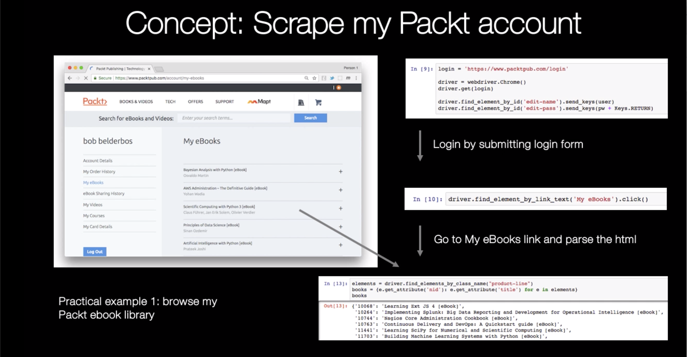

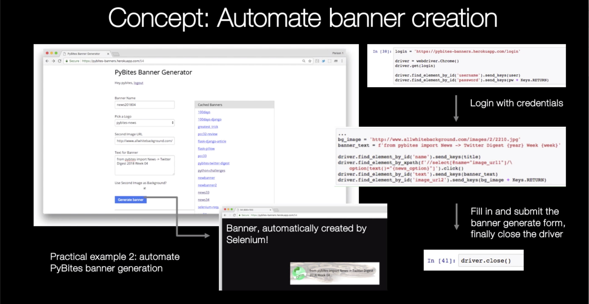


## Second + third day: practice time!

Now it's your turn. The goal is to have you get your hands dirty using Python Selenium.

### Testing with Selenium

I deliberately left testing out, because we have a nice code challenge for you to practice:

- First checkout the docs: [Using Selenium to write tests](http://selenium-python.readthedocs.io/getting-started.html#using-selenium-to-write-tests)
- Then head over to [Code Challenge 32 - Test a Simple Django App With Selenium](https://codechalleng.es/challenges/32/) and try to automate testing of [PyBites first ever Django App](http://pyplanet.herokuapp.com).

### Scratch your own itch

Although the testing option is our favorite, we want you to be free.

In this notebook I gave you two examples of automated tasks. Maybe you want to try them yourself, build them out?

Or what about trying to use Selenium on your favorite website or service? e.g. login to Facebook, Twitter, Reddit and read/post content ...

There are many possibilities. Again, having you code up a script using what you just learned will make all the difference in what you get out of this lesson. 

Have fun and remember: _Keep calm and code in Python!_

### Time to share what you've accomplished!

Be sure to share your last couple of days work on Twitter or Facebook. Use the hashtag **#100DaysOfCode**.

Here are [some examples](https://twitter.com/search?q=%23100DaysOfCode) to inspire you. Consider including [@talkpython](https://twitter.com/talkpython) and [@pybites](https://twitter.com/pybites) in your tweets.

*See a mistake in these instructions? Please [submit a new issue](https://github.com/talkpython/100daysofcode-with-python-course/issues) or fix it and [submit a PR](https://github.com/talkpython/100daysofcode-with-python-course/pulls).*


```python

```
